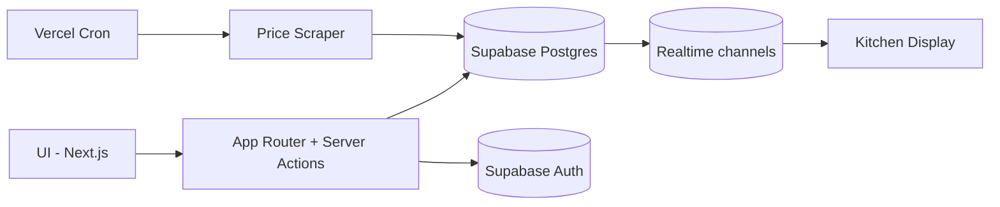

# Mise

[](https://github.com/Robayth-Dhrubo/Mise-KitchenSync/actions/workflows/ci.yml)

Restaurant operations platform. Tracks ingredient costs, calculates recipe margins in real-time, manages inventory, and runs a POS system — all from one codebase.

The core problem: when a supplier raises the price of chicken by $0.50/lb, every dish using chicken is now less profitable. Most restaurants don't find out until month-end P&L. Mise recalculates margins instantly.

## Architecture

```
Next.js 16 (App Router) → Supabase (Postgres + Auth + Realtime) → Vercel
```



**Stack:** Next.js 16, React 19, TypeScript 5, Supabase, Tailwind CSS 4 + shadcn/ui, TanStack Query, Recharts, Vitest, Playwright

## Setup

```bash
git clone https://github.com/Robayth-Dhrubo/Mise-KitchenSync.git
cd Mise-KitchenSync
npm install
cp .env.local.example .env.local  # fill in Supabase creds
npm run dev
```

Requires Node 22+. Run `supabase/schema.sql` against your Supabase project to set up the database.

### Environment

```env
# Required
NEXT_PUBLIC_SUPABASE_URL=
NEXT_PUBLIC_SUPABASE_ANON_KEY=

# Required in production
SUPABASE_SERVICE_ROLE_KEY=
CRON_SECRET=

# Optional — falls back to mock data with a UI indicator when missing
OPENAI_API_KEY=          # AI invoice scanning
GOOGLE_PLACES_API_KEY=   # vendor discovery
SENTRY_DSN=              # error monitoring
```

## What it does

**Recipe costing engine** (`src/lib/calculations.ts`) — the core of the app. Change an ingredient price → every recipe using it recalculates cost, margin, and profitability status (`excellent`/`good`/`warning`/`danger` based on food cost %).

**Inventory** — stock levels, par level alerts, unit conversion (buy in lbs, use in oz). Invoice scanner uses OpenAI Vision to extract line items from paper invoices and update stock automatically.

**POS** — floor map editor, order terminal, in-room dining for hotels, reservation system, kitchen display (KDS) via Supabase Realtime. Integrates with Square, Toast, and QuickBooks.

**Procurement** — vendor directory with Google Places discovery, price comparison across suppliers, smart ordering based on par levels, nightly price scraper cron job.

**OS Environment** — a native desktop-like experience for employees. Features functional utility apps (Calculator, Notes with local storage, AI Assistant for operational queries) and isolated native routing for complex modules like the Floor Map to prevent iframe conflicts and ensure a seamless, glassmorphic UI.

## Project layout

```
src/
├── app/
│   ├── (auth)/              # login, signup
│   ├── (dashboard)/         # authenticated routes
│   │   ├── dashboard/       # analytics overview
│   │   ├── inventory/       # stock tracking + invoice scanner
│   │   ├── menu/            # recipe CRUD + costing
│   │   ├── recipes/         # recipe detail views
│   │   ├── kitchen-manager/ # KDS
│   │   ├── finance/         # margin guard
│   │   └── integrations/    # Square, Toast, QuickBooks
│   ├── pos/                 # point of sale
│   │   ├── terminal/        # order entry
│   │   ├── ird/             # in-room dining
│   │   └── reservations/    # table booking
│   ├── guest/               # public menu (no auth)
│   ├── smart-order/         # procurement
│   ├── api/
│   │   ├── cron/            # nightly price scraper
│   │   ├── webhooks/        # POS order hooks
│   │   └── integrations/    # OAuth callbacks
│   └── actions/             # server actions
├── components/              # UI (shadcn/ui + custom)
├── lib/
│   ├── calculations.ts      # recipe cost engine
│   ├── scraper/             # price scraping
│   ├── supabase/            # client/server/admin clients
│   └── monitoring/          # sentry wrapper
├── middleware.ts             # auth guard
supabase/
└── schema.sql               # full DDL + RLS policies + triggers
```

## Database

10 tables with row-level security. Key relationships:

- `ingredients` → `recipe_items` → `recipes` (cost cascade)
- `suppliers` → `vendor_products` → `ingredients` (price comparison)
- `orders` → `order_items` → `recipes` (POS)
- `profiles` extends Supabase Auth with role (`foh`/`boh`/`admin`)

Inventory deduction is handled by a Postgres RPC (`deduct_inventory`) that logs sales and decrements stock in one transaction.

## Scripts

```bash
npm run dev          # dev server
npm run build        # production build
npm run typecheck    # tsc --noEmit
npm run test         # vitest
npm run lint         # eslint
npm run seed:dev     # seed local dev data
```

## Security

See [SECURITY.md](./SECURITY.md). RLS is enabled on every table. Server actions validate ownership. Mock data fallbacks are flagged in the UI.

## License

MIT
