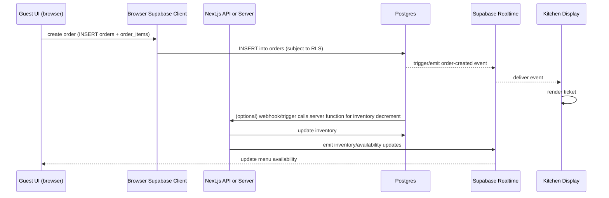
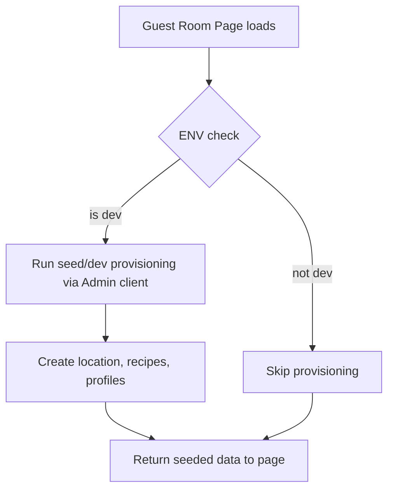
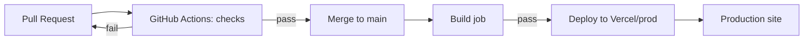

# Mise KitchenSync — Architecture & Workflows

This document provides a high-level architecture diagram, key components, data flows, and operational workflows for Mise KitchenSync. Diagrams use Mermaid syntax — you can render them in any editor (VS Code Mermaid preview) or the Mermaid live editor.

## 1 — High-level block diagram

```mermaid
flowchart LR
  subgraph CLIENTS
    Browser[Guest / POS / Admin UI (Next.js)]
    Kitchen[KDS Display]
    Mobile[Manager App]
  end

  subgraph NEXT_SERVER[Next.js App]
    Pages[App Router pages & server components]
    Middleware[Edge Middleware]
    APIRoutes[/api/* server routes]
  end

  subgraph SUPABASE[Supabase (Postgres + Realtime)]
    DB[(Postgres DB)]
    Realtime[(Realtime channels)]
    Auth[(Auth)]
    Storage[(Storage)]
  end

  subgraph SCRIPTS[Admin Scripts]
    Seed[scripts/seed-dev.ts]
    Tools[scripts/check-*.ts]
  end

  Browser -->|Anon client| Pages
  Pages -->|Server client| DB
  APIRoutes -->|Admin/client| DB

  Pages -->|Realtime subscriptions| Realtime
  Kitchen -->|Realtime subscribe| Realtime
  Mobile -->|Realtime subscribe| Realtime

  Seed -->|Service-role admin| DB
  Tools -->|Service-role admin| DB

  Auth --> DB
  Pages --> Auth
  Browser --> Auth
```

Notes:
- Client code (browser) uses the anon Supabase client (limited by RLS).
- Server code and admin scripts use service-role key only on the server-side.
- Realtime channels are used for KDS notifications and order updates.

---

## 2 — Order placement sequence (detailed)



Notes:
- Optionally, `Guest` may call an API route that validates and inserts to avoid client-side business logic.
- DB triggers or server functions ensure inventory accounting is consistent.

---

## 3 — Auto-provisioning gating (dev safety)



Implementation notes:
- Check conditions: `NODE_ENV === 'development' && SUPABASE_URL.includes('localhost')` or an explicit `ALLOW_DEV_SEED=true` env.
- Move seeding logic to `scripts/seed-dev.ts` and call it from the page only if gated.

---

## 4 — CI/CD pipeline

Recommended GitHub Actions jobs:
- checks (runs on PR):
  - install deps (npm ci)
  - typecheck (npm run typecheck)
  - unit tests (npm run test)
  - lint (optional)
- build (runs on main):
  - build app
  - produce artifact
- integration (optional, runs on main or scheduled):
  - setup test Supabase (secrets)
  - run integration tests
- deploy (runs on main after successful build):
  - push to Vercel or your chosen provider (use provider integration)

Mermaid for CI flow:



Security notes:
- Integration and deploy jobs that need SUPABASE_SERVICE_ROLE_KEY or DB access must use GitHub Secrets and be scoped to main only.
- Do not put secrets in PR logs or printed outputs.

---

## 5 — Data model overview (important tables)
- profiles: users and roles
- locations: sites/restaurants
- recipes: dish metadata (price, yield, steps)
- recipe_items: mapping of recipe -> ingredient + amount + unit
- ingredients: item data, price, unit conversion factors
- inventory: current stock per ingredient and location
- orders / order_items: guest or POS orders

Consider adding ER diagram in a follow-up doc if desired.

---

## 6 — Operational runbook (quick)
- Local dev:
  - copy `.env.local.example` to `.env.local` and set environment values
  - run `npm ci`
  - run DB migrations locally (see `supabase/schema.sql`)
  - run `npm run dev`
- Seeding dev data:
  - `node scripts/seed-dev.js` (or `ts-node scripts/seed-dev.ts`) — should be gated to dev only
- Checking connectivity:
  - `npx ts-node scripts/check-supabase-connection.ts`

---

## 7 — Next artifacts to add (I can create these)
- `docs/architecture.png` or exported SVG from Mermaid for external sharing
- `docs/er-diagram.md` (ER diagram generated from `supabase/schema.sql`)
- `docs/deploy-runbook.md` with step-by-step deployment and rollback

If you'd like, I can add the above files and also commit a `.github/workflows/ci.yml` next.
